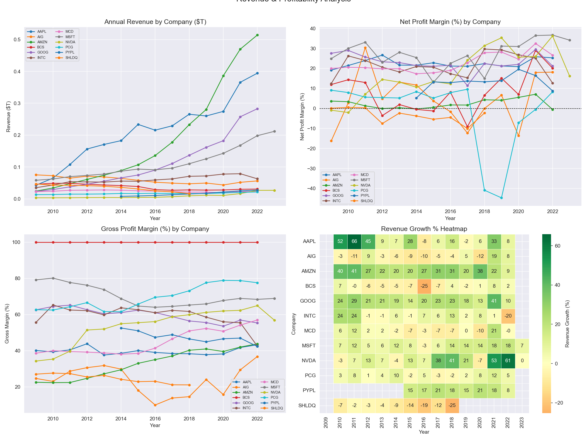
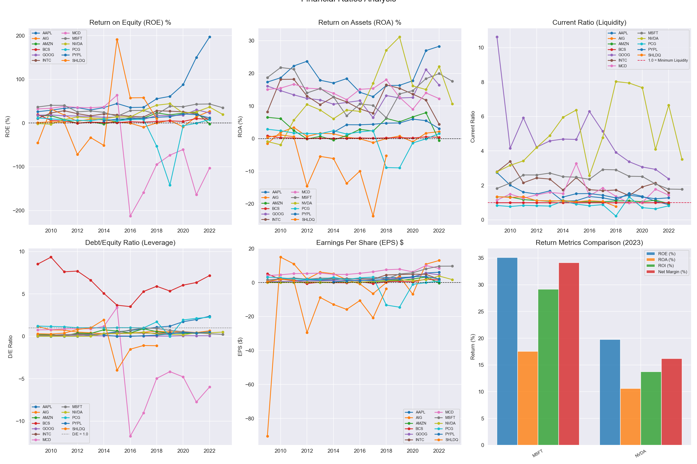
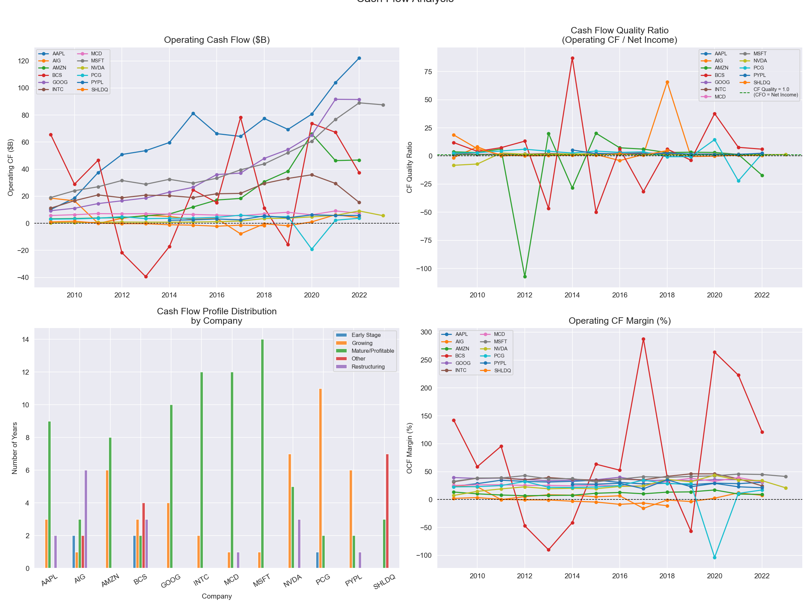
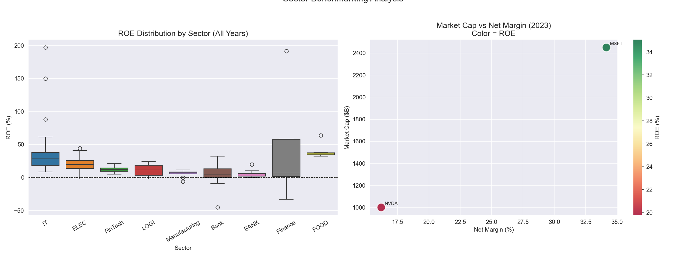
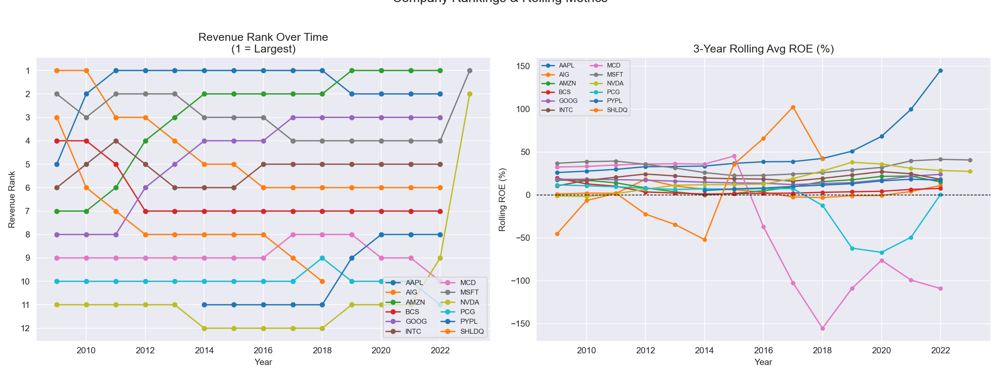
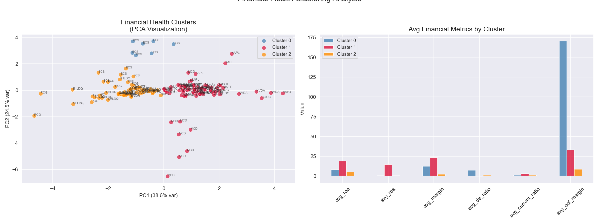
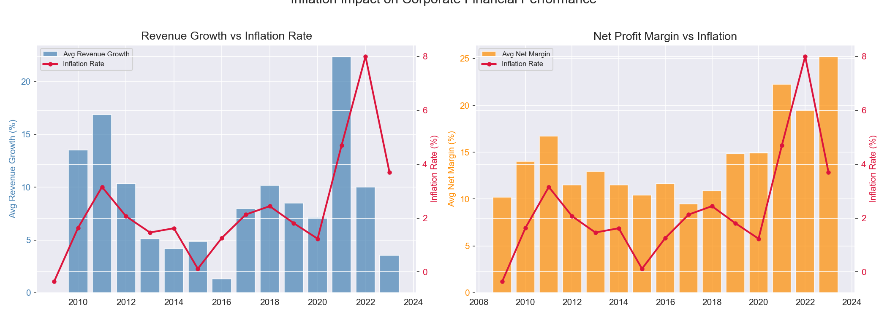

# Corporate Financial Statement Analysis — Revenue, Profitability & Financial Ratios

A SQL and Python analysis of financial statements from 12 major publicly traded companies (2009–2023), computing industry-standard financial ratios, benchmarking performance against sector peers, profiling cash flow health, and clustering companies by financial health profile using K-Means and PCA.

---

## Problem Statement
Financial statement analysis is the foundation of investment banking, equity research, corporate finance, and FP&A. This project analyzes 14 years of 10-K financial data to answer:
- Which companies generate the strongest revenue growth and margins?
- How do financial ratios compare across companies and sectors?
- What do cash flow profiles reveal about each company's business model maturity?
- Which companies deliver the best risk-adjusted returns on equity?
- How does inflation impact corporate financial performance?

---

## Dataset
- **Source:** [Kaggle — Financial Statements of Major Companies (2009–2023)](https://www.kaggle.com/datasets/rish59/financial-statements-of-major-companies2009-2023)
- **Size:** 161 records across 12 companies
- **Period:** 2009 — 2023
- **Companies:** AAPL, AIG, AMZN, BCS, GOOG, INTC, MCD, MSFT, NVDA, PCG, PYPL, SHLDQ
- **Database:** PostgreSQL (local)

---

## Tools & Libraries
- PostgreSQL, pgAdmin
- Python 3.x
- Pandas, NumPy
- Matplotlib, Seaborn
- Scikit-learn (KMeans, PCA, StandardScaler)
- SQLAlchemy, psycopg2

---

## Project Workflow
1. Data ingestion — loaded CSV into PostgreSQL via Python, standardized column names, engineered gross margin, EBITDA margin, revenue per employee, and YoY growth rates
2. SQL analysis — revenue and profitability trends with LAG-based growth, financial ratio benchmarking with sector averages, cash flow health profiling, multi-dimensional company ranking with Window Functions
3. Python visualization — revenue trends, profitability margins, financial ratios, cash flow profiles, sector benchmarking, company rankings, financial health clustering, inflation impact analysis
4. K-Means clustering — grouped companies into 3 financial health profiles using 6 standardized financial metrics with PCA visualization 

---

## SQL Techniques Demonstrated
- Common Table Expressions (CTEs)
- Window Functions (RANK, LAG for YoY growth, rolling 3-year AVG OVER, cumulative SUM OVER, PARTITION BY for sector peer comparison)
- NULLIF for safe division in margin calculations
- CASE WHEN for cash flow profile classification
- Multi-table sector average JOIN for peer benchmarking (ROE vs sector average)
- NULLS LAST for rankings with missing values

---

## Key Findings
- **MSFT leads on net margin (27.40%)** with a 2023 snapshot of 34.15% margin and $2,451B market cap — the clearest example of platform business economics in the dataset
- **AMZN leads on revenue growth (26.68%)** but trails on margin (2.36%) — a deliberate reinvestment strategy that requires FCF-based rather than earnings-based valuation frameworks
- **AAPL's ROE of 61.27%** — the highest in the dataset — is partially driven by aggressive share buybacks reducing shareholders' equity, illustrating why DuPont decomposition is essential for ROE interpretation
- **MCD's -42.21% average ROE** is a franchise accounting anomaly — negative equity from buybacks in a cash-generative business, not financial distress
- **SHLDQ shows all distress signals** — -10.50% revenue growth, -3.49% net margin, 7 years of "Other" cash flow profile, and bankruptcy in 2018, demonstrating how financial statement analysis identifies distress years in advance
- **K-Means Cluster 1 (financial elite)** — AAPL, GOOG, INTC, MCD, MSFT, NVDA — shows 18.88% avg ROE, 23.33% avg margin, and negative D/E reflecting buyback programs
- **BCS OCF margin of 170.46%** is a banking accounting artifact — loan origination is an operating activity for banks, making direct OCF comparison to non-financials misleading
- **High inflation years (2021-2022) coincided with expanding margins** for this tech-heavy dataset — confirming these companies have sufficient pricing power to pass inflation through to customers

---

## Visualizations

### Revenue & Profitability Trends

### Financial Ratios Analysis

### Cash Flow Analysis

### Sector Benchmarking

### Company Rankings & Rolling Metrics

### Financial Health Clustering

### Inflation Impact Analysis

---

## SQL Query Files
All queries are saved in the `sql/` folder:
- `01_create_table.sql` — schema creation
- `02_revenue_profitability.sql` — revenue and margin trends with LAG-based YoY growth
- `03_financial_ratios.sql` — ratio analysis with sector peer benchmarking via JOIN
- `04_cash_flow_analysis.sql` — cash flow health profiling with CASE classification and sector OCF ranking
- `05_window_functions.sql` — multi-dimensional rankings with RANK, rolling 3-year ROE, EPS growth, and cumulative revenue

---

## Limitations & Next Steps
- Only 12 companies — not a representative broad market sample
- Category labels inconsistent across records
- MCD and BCS require sector-specific interpretation frameworks
- Future work: EV/EBITDA valuation multiples, Altman Z-Score distress model, DuPont ROE decomposition, quarterly data extension, dividend yield and payout ratio analysis

---

## How to Run This Project
1. Clone the repository
2. Install PostgreSQL and pgAdmin from [postgresql.org](https://postgresql.org)
3. Create a database called `financial_statements` in pgAdmin
4. Download `financial_statements.csv` from [Kaggle](https://www.kaggle.com/datasets/rish59/financial-statements-of-major-companies2009-2023) and place it in the project root folder
5. Install Python dependencies: `pip install pandas numpy matplotlib seaborn scikit-learn sqlalchemy psycopg2-binary`
6. Open `financial_statement_analysis.ipynb` in Jupyter or VS Code
7. Update the database connection string with your PostgreSQL password
8. Run all cells — data loads automatically into PostgreSQL and all analysis runs end to end

---

## Repository Structure

---

## Author
**Mihrimah Qozat**
[LinkedIn](https://linkedin.com/in/mihrimah-qozat) |
[GitHub](https://github.com/mihrimahqozat)
